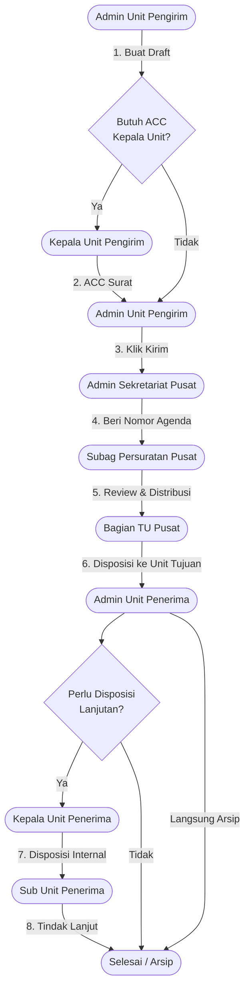
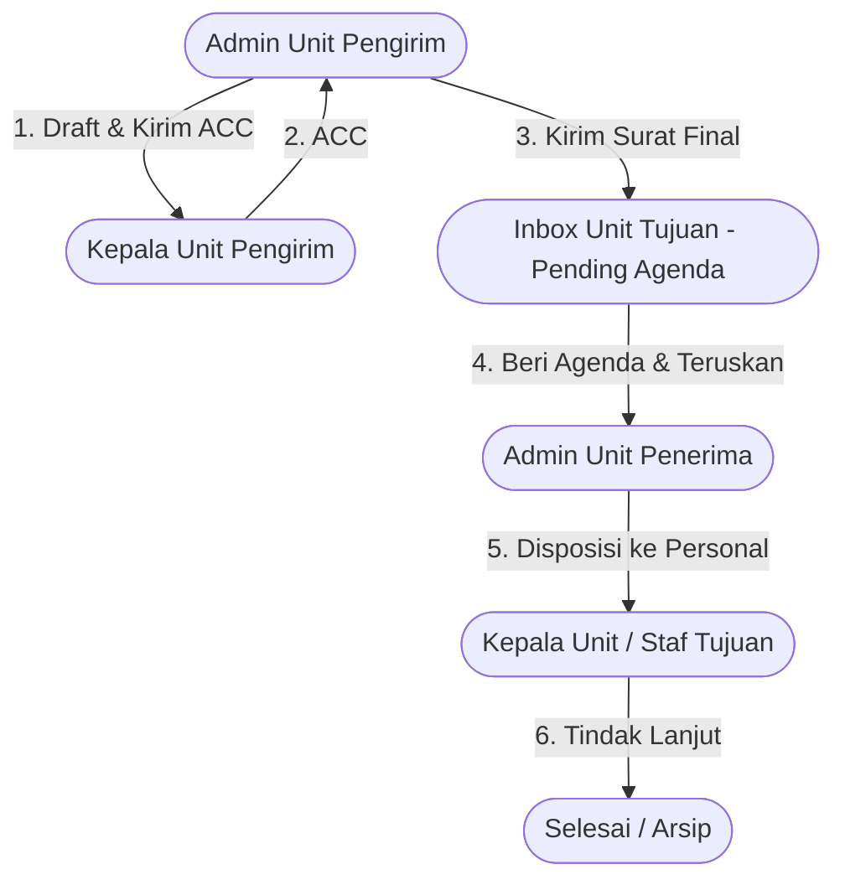
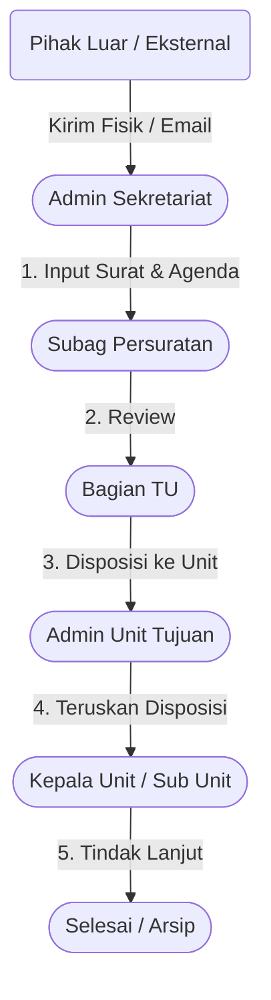
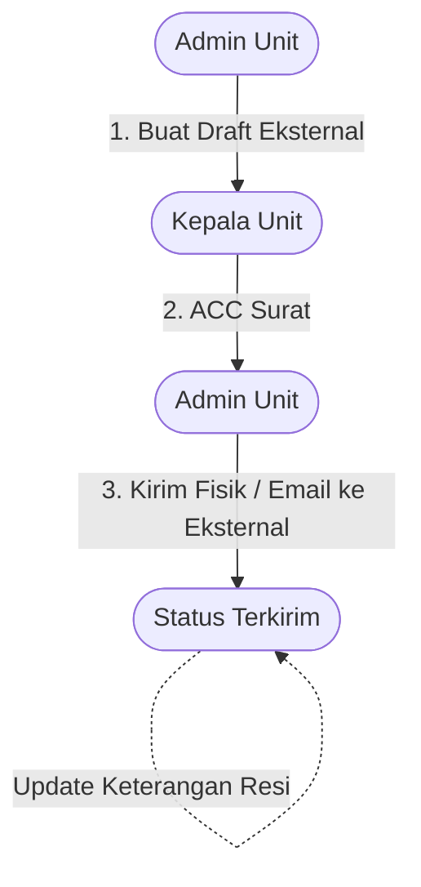

# 📩 Al Azhar Paperless System — Sistem Informasi Persuratan Digital

**Yayasan Pesantren Islam (YPI) Al Azhar**

> Aplikasi persuratan berbasis **Paperless** dengan arsitektur **Terdesentralisasi (Peer-to-Peer)** antar unit di lingkungan YPI Al Azhar. Mengambil konsep paperless yang ada di Gmail, aplikasi ini menawarkan antarmuka bergaya *mailbox* (Kotak Masuk, Kotak Keluar, Draf) yang intuitif, rapi, dan responsif. Setiap pergerakan surat diperlakukan layaknya pesan elektronik lengkap dengan pelacakan riwayat (*audit trail*) dan lampiran digital, menggantikan sepenuhnya kebutuhan dokumen fisik. Dibangun dengan **Laravel 12**, sistem ini menangani surat internal, surat masuk eksternal, surat keluar eksternal, disposisi berjenjang secara mandiri per-unit, dan arsip digital.

---

## 📑 Daftar Isi

- [Arsitektur & Filosofi Sistem](#-arsitektur--filosofi-sistem)
- [Alur Kerja (Workflow)](#-alur-kerja-workflow)
- [Hak Akses & Peran (Roles)](#-hak-akses--peran-roles)
- [Fitur Lengkap](#-fitur-lengkap)
- [Skema Database (ERD) & Status](#-skema-database-erd--status)
- [Instalasi & Pengaturan](#-instalasi--pengaturan)
- [Akun Default Pengujian](#-akun-default-pengujian)
- [Catatan Teknis & Keamanan](#-catatan-teknis--keamanan)

---

## 🏛 Arsitektur & Filosofi Sistem

Aplikasi ini menerapkan prinsip **Terdesentralisasi (Peer-to-Peer)**: unit-unit kerja memiliki otonomi penuh untuk saling mengirim dan merespons surat secara langsung, tanpa harus melewati birokrasi satu pintu (Sekretariat Pusat). 

1. **Otonomi Unit (Peer-to-Peer)** — Surat internal dapat dikirimkan langsung dari Unit A ke Unit B. Admin dari masing-masing unit penerima memiliki wewenang penuh untuk memberikan Nomor Agenda Masuk secara lokal dan mengatur alur disposisinya sendiri.
2. **Hierarki Cabang & Unit** — Data terstruktur rapi: **Cabang → Unit → Organ (Jabatan) → Pengguna**.
3. **Paperless** — Dokumen fisik didigitalisasi sebagai lampiran (PDF, DOCX, gambar) di dalam sistem.
4. **Audit Trail** — Setiap tindakan (kirim, ACC, agenda, disposisi, tanggapan, selesai) tercatat permanen di riwayat surat.

### Konsep Multi-Cabang & Multi-Peran

Aplikasi ini didesain agar sangat fleksibel dan *scalable* untuk menampung struktur organisasi berskala besar. Sistem mendukung konsep **Multi-Cabang** dan **Multi-Peran (Multi-Role)** dengan struktur dasar sebagai berikut:

```text
Cabang (Branch)
├── Unit Pusat (Pusat Kendali / Sekretariat Utama)
│   ├── Admin Pusat (Penerima & Agenda)
│   ├── Sub-Bagian Review
│   ├── Bagian Distribusi (Manajer Disposisi Utama)
│   └── Pimpinan Pusat (Pemantau)
├── Unit Cabang / Unit Kerja Biasa 1
│   ├── Admin Unit (Pengelola Surat Unit)
│   ├── Kepala Unit (Pemberi ACC & Disposisi)
│   └── Sub Unit / Staf (Pelaksana Disposisi)
└── Unit Cabang / Unit Kerja Biasa 2
    └── ... (Struktur peran mengikuti standar)
```

**Keterangan:**
- **Multi-Cabang**: Sistem mampu menaungi banyak wilayah operasional sekaligus secara terpusat.
- **Multi-Unit**: Setiap cabang memiliki unit-unit spesifik, dengan satu "Unit Pusat" yang difungsikan sebagai poros lalu lintas agenda (Sentralisasi Satu Pintu).
- **Multi-Peran (Role)**: Di dalam setiap unit, terdapat jabatan dan kewenangan hierarkis (*Admin*, *Kepala*, *Sub Unit*) sehingga kerahasiaan draf surat terjaga dan tugas didistribusikan kepada pihak yang tepat.

---

## 🔄 Alur Kerja (Workflow)

Berikut adalah diagram visual alur kerja pada aplikasi Al Azhar Paperless System berdasarkan jenis suratnya.

### 1. Surat Internal (Antar Unit)

Surat yang dibuat oleh sebuah unit dan ditujukan ke unit lain dalam YPI Al Azhar. Proses ini wajib melewati pusat (Sekretariat) untuk pendataan nomor agenda.



**Aturan Penting Alur Internal:**
### 1. Surat Internal (Antar Unit / Sekretariat)

Surat yang dibuat oleh satu unit untuk dikirim ke unit lain, atau ke Sekretariat Pusat. Surat internal kini wajib diberikan **Nomor Agenda** oleh **Unit Penerima** saat surat tiba di Inbox mereka.

**Alur Desentralisasi Penomoran Agenda:**
1. Semua surat internal yang telah di-ACC oleh Kepala Unit pengirim dan dikirim, akan masuk ke Inbox unit tujuan dengan status **Menunggu Agenda (pending_agenda)**.
2. Jika surat masuk ke **Sekretariat**, maka `admin_sekretariat` hanya akan memberikan Nomor Agenda, dan sistem otomatis meneruskannya ke Subag Persuratan untuk didisposisikan.
3. Jika surat masuk ke **Unit Kerja**, maka `admin_unit` akan memberikan Nomor Agenda lokasinya sendiri, dan secara bersamaan dalam pop-up yang sama, `admin_unit` dapat langsung memulai disposisi (meneruskan ke personal di unitnya).
4. Pemegang hak disposisi (`bagian_tu`, `kepala_sekretariat`, `kepala_unit`, `sub_unit`) kemudian akan memproses surat (disposisi ke bawahannya atau membalas/menyelesaikan).



### 2. Surat Masuk Eksternal

Surat dari pihak luar (eksternal) yang diterima oleh organisasi. Surat ini masuk ke satu pintu Sekretariat untuk kemudian didistribusikan.



### 3. Surat Keluar Eksternal

Surat yang ditujukan ke luar organisasi (eksternal). Tidak perlu melalui sentralisasi Sekretariat (nomor surat dan agenda dikelola sendiri oleh unit jika ada kebijakan masing-masing).


*Status langsung berubah menjadi **Terkirim**. Unit dapat memperbarui kolom "Keterangan" (misal: "Resi JNE: 12345").*

---

## 🧑‍💼 Hak Akses & Peran (Roles)

| Role | Tanggung Jawab Utama |
|------|----------------------|
| **`admin_sekretariat`** | Memberikan nomor agenda, meneruskan disposisi surat yang masuk ke sekretariat ke personal yang ada di sekretariat, membuat surat, dan mengarsipkan surat khusus sekretariat. |
| **`admin_unit`** | Membuat surat, memberikan nomor agenda, memulai proses disposisi, meneruskan disposisi surat yang masuk ke unitnya, dan mengarsipkan surat khusus unitnya. |
| **`subag_persuratan`** | Meng-ACC surat dari admin_sekretariat, memulai proses disposisi, dan mendisposisi surat yang spesifik ditujukan kepadanya. |
| **`bagian_tu`** | Mendisposisikan surat yang spesifik ditujukan kepadanya. |
| **`kepala_unit`** | Mendisposisikan surat yang spesifik ditujukan kepadanya (termasuk ACC surat keluar unitnya). |
| **`sub_unit`** | Mendisposisikan surat yang spesifik ditujukan kepadanya (melaksanakan tugas). |
| **`kepala_sekretariat`** | Memantau seluruh laju surat masuk dan keluar secara *read-only*, dan menerima/membuat disposisi. |

---

## ✨ Fitur Lengkap

### 📬 Manajemen & Tracking Surat
- **Laporan & History Terpusat**: Menu History untuk memantau semua surat yang sedang berproses disposisi (khusus role Sekretariat).
- **Inbox & Outbox Cerdas**: Filter otomatis memblokir surat draf/menunggu pengiriman agar tidak membingungkan penerima.
- **Badge Status Dinamis**: Menampilkan label "Terkirim" untuk surat keluar dan "Selesai" untuk surat masuk eksternal.
- **Notifikasi "Tugas"**: Menu sidebar akan memunculkan *badge* notifikasi merah berisikan angka jika ada tugas ACC atau Disposisi yang menunggu tindakan.

### 📋 Disposisi Lanjutan
- **Disposisi Lintas Unit & Personal**: Disposisi dapat ditujukan ke Unit (organisasi) maupun langsung ke Personal (jabatan/orang).
- **Cetak Lembar Disposisi**: Halaman *print-friendly* untuk mencetak riwayat dan arahan disposisi secara fisik.


## 🗄 Skema Database (ERD) & Status

**Status Lifecycle (Surat Internal):**
`draft` → `pending_approval` (Menunggu ACC) → `pending_sending` (Menunggu Dikirim Admin) → `pending_agenda` (Menunggu Agenda Pusat) → `in_review_subag` (Review Subag) → `in_review_bagian_tu` (Review TU) → `in_consideration` (Dipertimbangkan Unit Tujuan) → `completed` (Selesai/Arsip)

*(Catatan: Saat surat `completed`, label yang tampil di UI bisa berupa **Selesai** atau **Terkirim** tergantung jenis dan asal surat).*

---

## 🚀 Instalasi & Pengaturan

```bash
git clone https://github.com/donarazhar/paperless.git
cd paperless
composer install
npm install && npm run build
copy .env.example .env
php artisan key:generate

# Konfigurasi Database di .env
# DB_DATABASE=paperless
# DB_USERNAME=root

# Migrasi & Seed Database (Memuat semua Cabang, Unit, & User default)
php artisan migrate:fresh --seed

# Storage Link (Wajib untuk lampiran)
php artisan storage:link

php artisan serve
```

---

## 🔑 Akun Default Pengujian

Gunakan akun-akun berikut untuk menguji *workflow* (Password untuk semua akun: `123456`):

**Sekretariat YPI Al Azhar (Pusat):**
- `admin@example.com` (Admin Sekretariat)
- `subagsurat@example.com` (Subag Persuratan)
- `kabagiantu@example.com` (Bagian TU)

**Direktorat Keuangan:**
- `adminkeuangan@example.com` (Admin Unit)
- `kepalakeuangan@example.com` (Kepala Unit)

**Bagian ITTD:**
- `adminittd@example.com` (Admin Unit)
- `kepalaittd@example.com` (Kepala Unit)

*(Buka `DatabaseSeeder.php` untuk melihat senarai lengkap pengguna).*

---

## 🔒 Catatan Teknis & Keamanan

1. **Security URL**: Semua ID pada URL disamarkan menggunakan `Hashids` (misal: `/letters/Xy7K9`).
2. **Strict Inbound Filtering**: Fungsi `LetterController@inbound` didesain untuk memastikan kerahasiaan draf surat.
3. **Role Validation**: Akses tombol (Kirim, ACC, Agenda, Arsip) dilindungi ketat oleh kondisi `Auth::user()->role` baik di level antarmuka (Blade) maupun level Controller (`abort(403)`). 

---

*Dikembangkan untuk Yayasan Pesantren Islam Al Azhar.*
